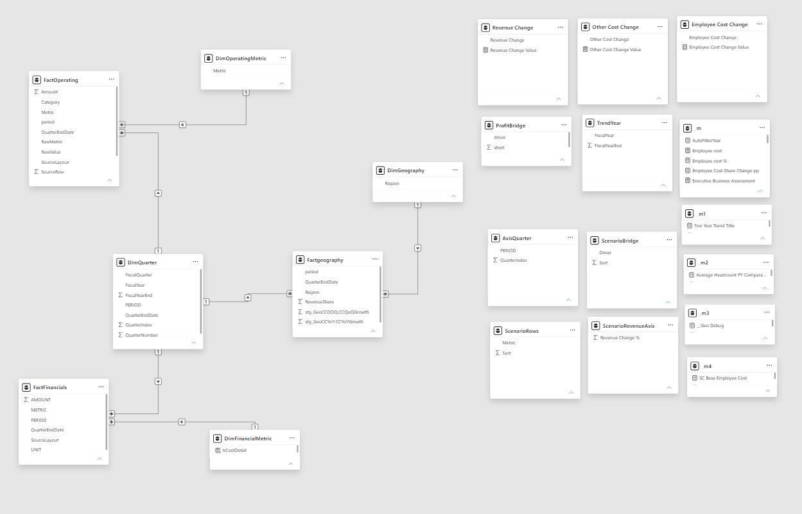

# TCS Financial & Operating Performance Analysis
**Data Source: Publicly available financial and operating TCS real data from TCS Investor Relations — Q1 FY2027 Data Sheet.**

**An interactive Power BI report exploring growth, profitability, costs, workforce performance, and geographic exposure.**

**Power BI · Power Query · DAX · Excel · Dimensional Modeling**

[View Report PDF](Report/TCS%20Financial%20Performance%20Analysis%20%281%29.pdf)

## Project Overview

How does revenue growth translate into profit, and where should a business investigate pressure on performance?

This independent portfolio project uses TCS financial and operating data to answer that question through a five-page Power BI report. It brings together quarterly financial results, workforce metrics, and geographic performance to support structured business analysis.

I developed the workflow from Excel data preparation in Power Query to dimensional modeling, DAX calculations, interactive report design, and dynamic business commentary.

## Business Questions

- Is revenue growth translating into stronger operating profit?
- How much of the profit change is associated with revenue growth versus margin changes?
- Which cost categories contribute most to pressure on profitability?
- How are headcount and revenue per employee changing together?
- Which regions contribute the most revenue, and which are contracting?
- How would changes in revenue and costs affect operating profit?

## Data and Coverage

| Item | Description |
|---|---|
| Source | Supplied TCS quarterly financial and operating data workbook: `TCS-Data-Sheet-Q1FY27(1).xlsx` |
| Financial coverage | Q1 FY2011–Q1 FY2027 |
| Reporting frequency | Quarterly |
| Fiscal calendar | April–March; Q1 FY2027 ends on 30 June 2026 |
| Financial units | ₹ crore unless otherwise stated |
| Other units | Employees, ₹ per share, percentages, and percentage points as applicable |
| Operating coverage | Varies by metric; some series begin later or are discontinued |

The report is based on the supplied workbook and is not a live financial feed.

## Report Pages

### 1. Executive Overview

**Purpose:** Understand the overall financial position before exploring individual drivers.

Revenue, operating profit, operating margin, shareholder profit, and trailing twelve-month revenue provide a summary of performance. Quarterly trends and revenue allocation provide context for the selected period.

**Business value:** Helps stakeholders identify areas that require deeper investigation.

### 2. Growth & Profitability

**Purpose:** Examine the quality of growth and its relationship with profitability.

- Matching-period revenue and operating profit comparisons.
- Revenue and margin contributions to operating profit change.
- Quarterly growth and margin comparisons.
- Five-year performance trends and trailing twelve-month revenue analysis.

**Business value:** Helps distinguish growth supported by improving margins from growth accompanied by margin pressure.

### 3. Cost & Workforce

**Purpose:** Understand cost pressure and the relationship between workforce spending and revenue.

- Operating costs, employee costs, and consultant expenses.
- Comparable cost-category contributions to profit change.
- Headcount trends and revenue per employee.
- Revenue growth compared with average-headcount growth.

**Business value:** Supports investigation of cost intensity, staffing requirements, and delivery capacity. Revenue per employee is treated as an indicator, not a direct measure of employee productivity.

### 4. Geography & Operating Drivers

**Purpose:** Identify geographic concentration and markets that need attention.

- Regional revenue shares.
- Regional constant-currency YoY and QoQ growth.
- Top-two-region revenue concentration.
- Revenue exposure to regions with negative constant-currency YoY growth.
- Regional scorecards and trends.

**Business value:** Helps stakeholders assess dependence on major markets and prioritize regional performance reviews.

### 5. Scenario & Methodology

**Purpose:** Explore how revenue and cost assumptions affect operating profit.

Users adjust revenue, employee costs, and other operating costs relative to a selected base quarter. The page compares base and scenario results, explains the profit change, and shows the revenue growth needed to preserve base operating profit.

**Business value:** Supports discussion of trade-offs and profit sensitivity. Scenario outputs are assumption-based simulations, not forecasts.

## Technical Approach

### Power Query: Data Preparation

- Cleaned metric labels and standardized data types.
- Unpivoted quarterly columns into a consistent row-based structure.
- Aligned comparable historical and recent metric names.
- Converted historical monetary figures from ₹ million to ₹ crore where required.
- Prepared fiscal-period and quarter-end-date fields.
- Combined financial records and prepared operating and geography datasets.
- Preserved unavailable values as blanks rather than treating them as zero.

### Data Model

Separate financial, operating, and geography fact tables connect to shared quarter and relevant metric dimensions. One-to-many relationships support filtering at each fact table's reporting grain. Disconnected helper tables support scenario inputs and selected analytical views.

### DAX and Report Features

- Matching-quarter prior-year comparisons.
- Quarterly growth, weighted period margins, and margin changes.
- Trailing twelve-month revenue and growth.
- Revenue and margin decomposition of operating profit changes.
- Cost comparisons and workforce indicators.
- Regional concentration and contracting-market exposure.
- What-if scenario calculations and sensitivity analysis.
- Dynamic titles, business commentary, conditional formatting, and page navigation.

## Calculation Methodology

| Metric | Definition |
|---|---|
| YoY growth | `(Current − Prior year) ÷ Prior year`, using matching quarters |
| Operating margin | `Operating profit ÷ Revenue` |
| Margin change | `(Current margin − Comparison margin) × 100`, expressed in percentage points |
| Revenue TTM | Revenue for four consecutive quarters ending in the selected quarter |
| Incremental operating margin | `Change in operating profit ÷ Change in revenue` |
| Revenue effect on profit | `Revenue change × Prior-year operating margin` |
| Margin effect on profit | `Current revenue × Change in operating margin` |
| Revenue per employee | `Period revenue ÷ Average headcount`, with the displayed monetary unit conversion |
| Contracting-market exposure | Revenue share of regions with negative constant-currency YoY growth |
| Scenario operating profit | `Scenario revenue − Scenario employee costs − Scenario other operating costs` |

Period operating margin uses total operating profit divided by total revenue, rather than a simple average of quarterly margins. Revenue and margin effects reconcile arithmetically to operating profit change; they do not establish business causation.

## Interpretation and Limitations

- **Adjusted financial basis:** Periods marked `EX-ADJ` follow the source's exclusion of exceptional items. This basis carries into comparisons and scenario calculations.
- **Historical comparability:** Changes in expense definitions and classifications can limit detailed comparisons.
- **Missing data:** Blank values represent unavailable or inapplicable information, not necessarily zero activity.
- **Currency:** Reported INR growth and constant-currency growth are different measures. Their difference is not treated as an exact currency contribution.
- **Workforce:** Revenue per employee can change because of pricing, exchange rates, service mix, and staffing.
- **Scenarios:** Revenue and cost assumptions are applied independently. Tax, cash flow, and automatic links between staffing and demand are not modeled.
- **Business commentary:** Suggested investigations are analytical prompts, not confirmed causes or guaranteed outcomes.

## Repository Contents

| Path | Contents |
|---|---|
| `README.md` | Project overview, report previews, and methodology |
| `Report/TCS-Financial-Performance.pbix` | Power BI report and semantic model |
| `Report/TCS-Financial-Performance.pdf` | Static report export |
| `Screenshots/` | Images of the five report pages |
| `Documentation/Data-Model.png` | Model diagram |

## How to Explore the Project

1. Review the screenshots or open the PDF for a quick walkthrough.
2. Download the `.pbix` file and open it in Power BI Desktop.
3. Use the quarter, fiscal-year, and region selections to explore the relevant pages.
4. Adjust the Scenario page inputs to compare assumptions against the base quarter.
5. To refresh, obtain the source workbook and update the relevant Power Query source paths. The workbook is not assumed to be included in this repository.

GitHub provides the project files and static previews. Use Power BI Desktop to explore the report interactively.

## Author

**Dipankar Pal**  
Power BI and Data Analytics Portfolio  
[GitHub Profile](https://github.com/dipankar-pal)

Feedback on analytical methodology, DAX, data modeling, and report usability is welcome.

---

*Independent portfolio project using TCS data. Not an official TCS report or investment recommendation. TCS names and logos belong to their respective owners.*

